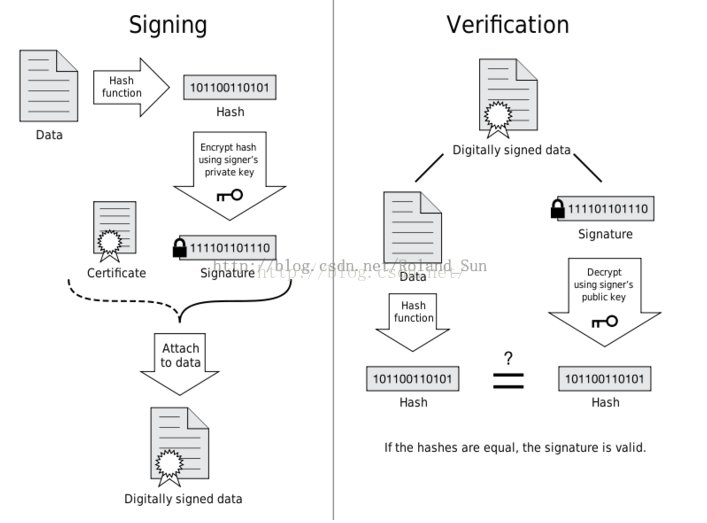
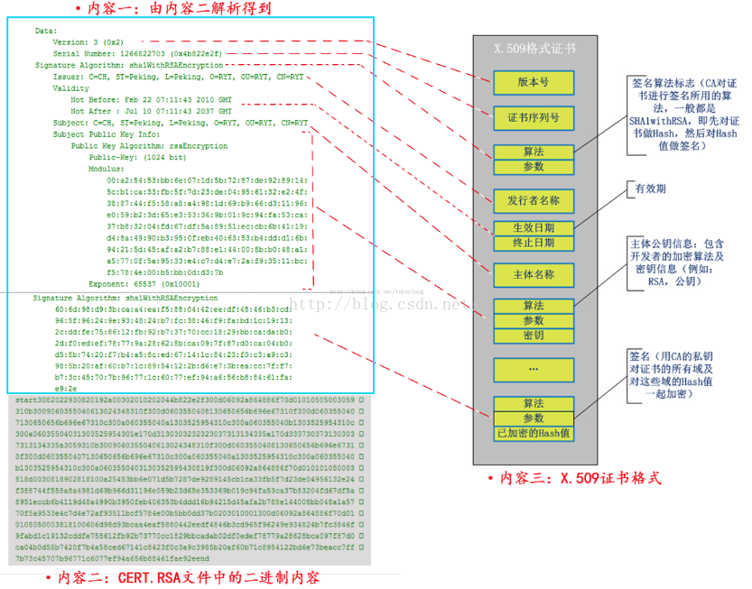

# 安卓签名相关

首先需要了解几个知识点
* 数据摘要（数据指纹）、签名文件，证书文件
* jarsign工具签名和signapk工具签名
* keystore 文件和pk8文件,x509.pem文件的关系
* 如何手动签名apk

### 数据摘要 
其实就是某一段数据源通过一个算法得到一个摘要，也叫做数据指纹。

消息摘要算法（Message Digest Algorithm）是一种能产生特殊输出格式的算法，其原理是根据一定的运算
规则对原始数据进行某种形式的信息提取，被提取出的信息就被称作原始数据的消息摘要。

消息摘要的主要特点有：
1）无论输入的消息有多长，计算出来的消息摘要的**长度总是固定的**。例如应用MD5算法摘要的消息有128个比特位，
用SHA-1算法摘要的消息最终有160比特位的输出。
2）一般来说（不考虑碰撞的情况下），只要输入的原始数据不同，对其进行摘要以后产生的消息摘要也必不相同，
即使原始数据稍有改变，输出的消息摘要便完全不同。但是，相同的输入**必会产生相同的输出**。
3）具有**不可逆性**，即只能进行正向的信息摘要，而无法从摘要中恢复出任何的原始消息。

### 签名文件和证书
这两个东西不可分离，成对出现。这两个文件名称一样，只是后缀名不一样。

如果需要确保通信，那么需要解决两个问题：
1. 确定消息来源是否是申明的那个人
2. 保证消息传递过程中不被第三方篡改，即使篡改也能被发现

针对上面的问题，就出现了**数字签名**

对于消息发送者来说，先要生成一对公私钥对，将公钥提供给消息接受者。
如果消息的发送者有一天想给消息接收者发消息，在发送的信息中，除了要包含原始的消息外，
还要加上另外一段消息。这段消息通过如下两步生成：
1. 对要发送的原始消息提取消息摘要；
2. 对提取的信息摘要用自己的私钥加密。

发送方：上面通过**数据指纹（摘要） + 私钥加密**之后的数据，就是数字签名。

数据接收方，通过两部分消息：数据 + 数字签名 来验证消息的真伪：
1. 对原始数据进行消息摘要提取，这里用到和发送方一样的摘要算法
2. 对附加的数字签名，使用公钥解密
3. 比较是否一致。

不知道大家有没有注意，前面讲的这种数字签名方法，有一个前提，就是消息的接收者必须要事先得到正确的公钥
。如果一开始公钥就被别人篡改了，那坏人就会被你当成好人，而真正的消息发送者给你发的消息会被你视作无
效的。而且，很多时候根本就不具备事先沟通公钥的信息通道。那么如何保证公钥的安全可信呢？这就要靠数字
证书来解决了。

所谓数字证书，一般包含以下一些内容：
* 证书的发布机构（Issuer）
* 证书的有效期（Validity）
* 消息发送方的公钥
* 证书所有者（Subject）
* 数字签名所使用的算法
* 数字签名
可以看出，数字证书其实也用到了数字签名技术。只不过要签名的内容是消息发送方的公钥，以及一些其它信息。
但与普通数字签名不同的是，数字证书中签名者不是随随便便一个普通的机构，而是要有一定公信力的机构。
这就好像你的大学毕业证书上签名的一般都是德高望重的校长一样。一般来说，这些有公信力机构的根证书已经
在设备出厂前预先安装到了你的设备上了。所以，数字证书可以保证数字证书里的公钥确实是这个证书的所有者的
，或者证书可以用来确认对方的身份。数字证书主要是用来解决公钥的安全发放问题。

### jarsign工具签名和signapk工具签名
一个是对jar签名的工具，一个是对apk进行签名的工具

### keystore文件和pk8，x509.pem文件的区别
我们上面了解到了jarsign和signapk两个工具都可以进行Android中的签名，那么他们的区别在于签名时使用的文件不一样

* jarsign工具签名时使用的是keystore文件
* signapk工具签名时使用的是pk8,x509.pem文件

## 安卓的签名流程
通过上面的签名时我们可以看到，Android签名apk之后，会有一个META-INF文件夹，这里有三个文件：

* MANIFEST.MF
* CERT.RSA
* CERT.SF
#### MANIFEST.MF
下面是对应源码

    public static void main(String[] args) {
        if (args.length != 4) {
            System.err.println("Usage: signapk " +
                    "publickey.x509[.pem] privatekey.pk8 " +
                    "input.jar output.jar");
            System.exit(2);
        }
     
        JarFile inputJar = null;
        JarOutputStream outputJar = null;
     
        try {
            X509Certificate publicKey = readPublicKey(new File(args[0]));
     
            // Assume the certificate is valid for at least an hour.
            long timestamp = publicKey.getNotBefore().getTime() + 3600L * 1000;
     
            PrivateKey privateKey = readPrivateKey(new File(args[1]));
            inputJar = new JarFile(new File(args[2]), false);  // Don't verify.
            outputJar = new JarOutputStream(new FileOutputStream(args[3]));
            outputJar.setLevel(9);
     
            JarEntry je;
     
            // MANIFEST.MF
            Manifest manifest = addDigestsToManifest(inputJar);
            je = new JarEntry(JarFile.MANIFEST_NAME);
            je.setTime(timestamp);
            outputJar.putNextEntry(je);
            manifest.write(outputJar);
     
            // CERT.SF
            Signature signature = Signature.getInstance("SHA1withRSA");
            signature.initSign(privateKey);
            je = new JarEntry(CERT_SF_NAME);
            je.setTime(timestamp);
            outputJar.putNextEntry(je);
            writeSignatureFile(manifest,
                    new SignatureOutputStream(outputJar, signature));
     
            // CERT.RSA
            je = new JarEntry(CERT_RSA_NAME);
            je.setTime(timestamp);
            outputJar.putNextEntry(je);
            writeSignatureBlock(signature, publicKey, outputJar);
     
            // Everything else
            copyFiles(manifest, inputJar, outputJar, timestamp);
        } catch (Exception e) {
            e.printStackTrace();
            System.exit(1);
        } finally {
            try {
                if (inputJar != null) inputJar.close();
                if (outputJar != null) outputJar.close();
            } catch (IOException e) {
                e.printStackTrace();
                System.exit(1);
            }
        }
    }

那么从上面的分析我们就知道了，其实MANIFEST.MF中存储的是：

逐一遍历里面的所有条目，如果是目录就跳过，如果是一个文件，就用SHA1（或者SHA256）消息摘要算法提取
出该文件的摘要然后进行BASE64编码后，作为“SHA1-Digest”属性的值写入到MANIFEST.MF文件中的一个块中。
该块有一个“Name”属性，其值就是该文件在apk包中的路径。

#### CERT.SF 文件
关键代码

    //CERT.SF
    Signature signature = Signature.getInstance("SHA1withRSA");
    signature.initSign(privateKey);
    je = new JarEntry(CERT_SF_NAME);
    je.setTime(timestamp);
    outputJar.putNextEntry(je);
    writeSignatureFile(manifest,new SignatureOutputStream(outputJar, signature));
    
    /** Write a .SF file with a digest the specified manifest. */
    private static void writeSignatureFile(Manifest manifest, OutputStream out)
            throws IOException, GeneralSecurityException {
        Manifest sf = new Manifest();
        Attributes main = sf.getMainAttributes();
        main.putValue("Signature-Version", "1.0");
        main.putValue("Created-By", "1.0 (Android SignApk)");
     
        BASE64Encoder base64 = new BASE64Encoder();
        MessageDigest md = MessageDigest.getInstance("SHA1");
        PrintStream print = new PrintStream(
                new DigestOutputStream(new ByteArrayOutputStream(), md),
                true, "UTF-8");
     
        // Digest of the entire manifest
        manifest.write(print);
        print.flush();
        main.putValue("SHA1-Digest-Manifest", base64.encode(md.digest()));
     
        Map<String, Attributes> entries = manifest.getEntries();
        for (Map.Entry<String, Attributes> entry : entries.entrySet()) {
            // Digest of the manifest stanza for this entry.
            print.print("Name: " + entry.getKey() + "\r\n");
            for (Map.Entry<Object, Object> att : entry.getValue().entrySet()) {
                print.print(att.getKey() + ": " + att.getValue() + "\r\n");
            }
            print.print("\r\n");
            print.flush();
     
            Attributes sfAttr = new Attributes();
            sfAttr.putValue("SHA1-Digest", base64.encode(md.digest()));
            sf.getEntries().put(entry.getKey(), sfAttr);
        }
     
        sf.write(out);
    }
    
可以明确 CERT.SF文件的主要内容是做了
1. 计算这个MANIFEST.MF文件的整体SHA1值，再经过BASE64编码后，记录在CERT.SF主属性块（在文件头上）的
“SHA1-Digest-Manifest”属性值值下

2. 逐条计算MANIFEST.MF文件中每一个块的SHA1，并经过BASE64编码后，记录在CERT.SF中的同名块中，属性的
名字是“SHA1-Digest

#### CERT.RSA文件

这里我们看到的都是二进制文件，因为RSA文件加密了，所以我们需要用openssl命令才能查看其内容

    openssl pkcs7 -inform DER -in CERT.RSA -noout -print_certs –text
    
如下图

相关代码

    /** Write a .RSA file with a digital signature. */
    private static void writeSignatureBlock(
            Signature signature, X509Certificate publicKey, OutputStream out)
            throws IOException, GeneralSecurityException {
        SignerInfo signerInfo = new SignerInfo(
                new X500Name(publicKey.getIssuerX500Principal().getName()),
                publicKey.getSerialNumber(),
                AlgorithmId.get("SHA1"),
                AlgorithmId.get("RSA"),
                signature.sign());
     
        PKCS7 pkcs7 = new PKCS7(
                new AlgorithmId[] { AlgorithmId.get("SHA1") },
                new ContentInfo(ContentInfo.DATA_OID, null),
                new X509Certificate[] { publicKey },
                new SignerInfo[] { signerInfo });
     
        pkcs7.encodeSignedData(out);
    }

我们看到，这里会把之前生成的 CERT.SF文件， 用私钥计算出签名, 然后将签名以及包含公钥信息的数字证书
一同写入  CERT.RSA  中保存。CERT.RSA是一个满足PKCS7格式的文件。