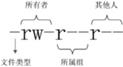

# Linux常用命令

### 命令提示符

登录系统看到的第一句

```
[root@localhost ~] #
```

[] 、@ 分隔符

root 当前登录的用户

localhost 当前系统简写主机名称 完成为 localhost.localdomain

~ 表示当前所在目录，这里是用户主目录。/root/    /home/用户名

\# 命令提示符 超级用户用#，普通用户$  

### 命令基本格式

```
命令 [选项] [参数]
```

其中选项分为两种，短选项跟长选项。例如

```sh
ls -l #短选项 一个 — 且英文缩写
ls --all # 长选项 两个- 完整单词
# 上面两个意义一样
```

参数可以是文件、目录、进程。参数一般不可以省略，如果省略则代表有默认参数。如ls 则表示为当前目录

#### ls命令

显示目录下的内容。

选项

```shell
-a # 显示所有文件
--color=when # when 默认是always 也可以是never和auto
-d # 显示目录信息
-h # 人性化显示，按照我们习惯单位显示文件大小
-i # 显示文件i节点号 每个文件都有一个被称作 inode（i 节点）的隐藏属性，可以看成系统搜索这个文件的 ID，而"-i"选项就是用来査看文件的 inode 号的
-l # 长格式显示


```

#### cd命令

切换目录

Linux命令分为两种：Shell内置命令和外部命令。所谓内置命令就是，Shell自带命令，没有执行文件的。外部命令是由程序员自己开发，有执行文件的。Linux中大部分都是外部命令，但是CD是没有执行文件的，是Shell的内置命令。

快捷操作目录

| 特殊符号 | 作用             |
| -------- | ---------------- |
| ~        | 用户家目录       |
| -        | 用户上次所在目录 |
| .        | 代表当前目录     |
| ..       | 上级目录         |

#### mkdir命令

创建目录

```shell
-p # 循环建立所需目录
```

#### rmdir命令

删除空目录，如果目录中有内容和文件就会报错，删除失败，用途比较局限

```shell
-p # 循环删除所需目录
```

#### touch命令

修改文件的时间戳，如果文件不存在会创建一个空文件。如果存在，则会改变文件的时间戳。

Linux 中所有文件有三个时间，注意，Linux中是没有文件创建时间的。

* 访问时间

* 数据修改时间

* 状态修改时间


#### stat命令

显示文件或文件系统的详细信息

```shell
-f # 显示文件系统信息，而不是查看文件信息
```

#### cat命令

连接文件，并打印输出到标准输出设备

- -A：相当于 -vET 选项的整合，用于列出所有隐藏符号；
- -E：列出每行结尾的回车符 $；
- -n：显示行号；
- -T：把 Tab 键 ^I 显示出来；
- -V：列出特殊字符；

#### more命令

分屏显示文件内容，用于cat命令文件过大时候，方便查看用。

#### head 命令

显示文件开头的命令：output the first part of the files.

```shell
-n # 行数，指定显示行数。默认显示十行
-v # 显示文件名
```


#### tail命令

显示文件尾命令

#### ln 命令

文件之间建立链接（硬链接和软链接）

Linux文件系统使用的ext4文件系统，主要分为两块 ：inode节点块、block数据块

* inode块：文件头信息，包括文件时间戳，权限，真实数据存储的block号。默认大小128byte

* block块：数据块，包括文件名称，默认大小为4kb，一个文件可能包含多个block块，可能连续也可能分散。


```shell
ln [选项] 源文件 目标文件
-s # 建立软连接文件，如果不加-s则建立硬链接文件
-f # 强制。如果目标文件已经存在，则删除目标文件后再建立链接文件
```

**建立软连接，源文件必须要写绝对路径，否则会报错。硬链接没有要求。**

##### 硬链接和软连接区别

* 硬链接 不会新建inode和block，直接指向的是源文件的inode节点。不常用
  * 只要不是全删除，原来inode文件就能访问

* 软连接 又称为符号链接，有点类似快捷方式。创建自己的inode，且在创建的block中指向源文件的inode号及文件名。
  * 可以链接目录，可以跨分区
  * 删除软连接文件，源文件不受影响。删除源文件，软链接文件会报找不到实际数据
  * 修改源文件和软链接文件都能达到修改源文件效果，直接修改的数据为源文件中的block块数据


#### rm 命令

删除命令，包括文件和目录。

```shell
rm [选项] 目录/文件
-f # 强制删除
-i # 交互删除，会询问用户
-r # 递归删除，可以循环删除目录
```

#### cp命令

复制文件和目录

```shell
cp [选项] 源文件 目标文件
-a # -d -p -r 选项的集合
-d # 如果源文件为软链接(硬链接无效)，则复制出来的也是软链接
-i # 询问，如果目标文件存在，会询问是否覆盖
-l # 把目标文件建立为源文件的硬链接文件，而不是复制源文件。有点类似 ln命令
-s # 建立软链接，有点类似 ln -s
-p # 复制后保留源文件属性
-r # 递归复制，用来复制目录
```

#### mv命令

```shell
-f # 覆盖，强制移动
-n # 如果有同名直接跳过
-i # 交互移动，如果有覆盖询问是否覆盖
-v # 显示详细信息
```

#### Linux文件权限

文件所有者，所属组，其他人

-rw-r--r-- 读写可执行（rwx）



文件类型包括

- -"-"：普通文件。
- -"b"：块设备文件。这是一种特殊设备文件，存储设备都是这种文件，如分区文件 /dev/sda1 就是这种文件。
- -"c"：字符设备文件。这也是特殊设备文件，输入设备一般都是这种文件，如鼠标、键盘等。
- -"d"：目录文件。Linux 中一切皆文件，所以目录也是文件的一种。
- -"l"：软链接文件。
- -"p"：管道符文件。这是一种非常少见的特殊设备文件。
- -"s"：套接字文件。这也是一种特殊设备文件，一些服务支持 Socket 访问，就会产生这样的文件。