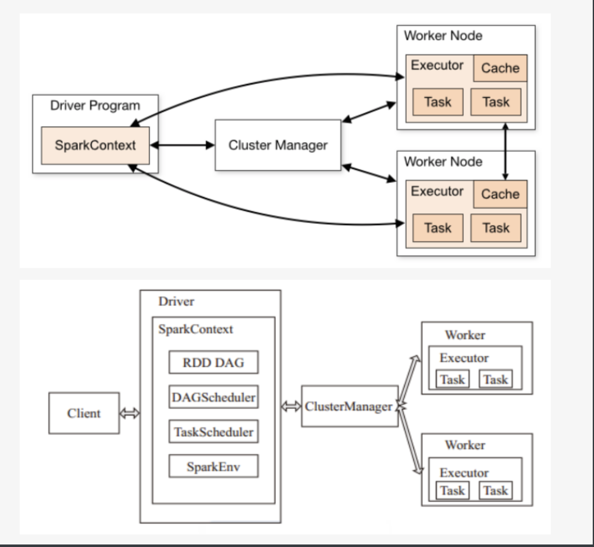
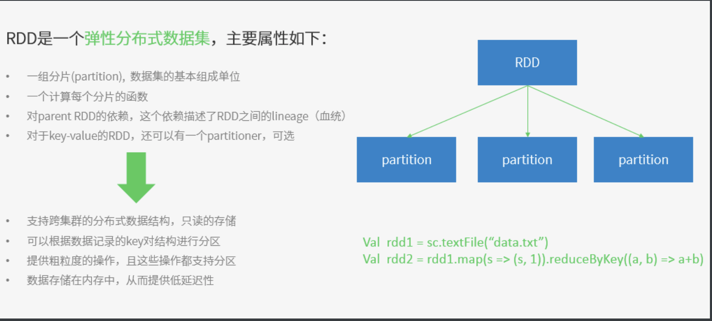

# Spark介绍

教程学习：https://www.w3cschool.cn/spark/spark-quickstart.html

大数据计算框架，官方定义为：通用的大数据快速处理引擎

包含大数据常见的计算框架

* Spark Core 离线计算
* Spark sql 交互式查询
* Spark Streaming 实时流计算
* Spark MLlib 机器学习
* Spark GraphX 用于图计算

一般 Spark用于大数据计算 hadoop用于大数据存储，资源调度（Yarn）

##### Spark计算处理速度快的原因

- 基于内存的计算方式
- 基于DAG 有向无环图（在[图论](https://baike.baidu.com/item/%E5%9B%BE%E8%AE%BA)中，如果一个[有向图](https://baike.baidu.com/item/%E6%9C%89%E5%90%91%E5%9B%BE)无法从某个顶点出发经过若干条边回到该点，则这个图是一个**有向无环图**）

##### Spark运行架构图

##### Spark模型 master-slave 模型

Master对应的集群中含有Master进程的节点，Slave对应的集群中含有Worker进程的节点

* Master 整个集群控制器，负责整个集群正常运行
* Worker作为计算节点，负责接收主节点命令进行状态汇报
* Executor 负责任务执行
* Client 用户客户端，提交应用
* Driver 负责应用执行

##### 基本概念

* application  Spark应用程序，包含一个Driver Program和若干Executor
* SparkContext ：Spark应用程序入口，负责调度各个运算资源，协调各个Worker Node上的executor
* Driver program ：运行Application的main，创建SparkContext
* Executor：是Application运行在Worker node上的一个进程，负责运行task，每个application都会申请自己的executor来执行任务
* Cluster Manager:用于集群中获取资源的外部服务
* Worker node:集群中任何一个可以运行Application的节点，运行一个或者多个executor进程
* Task：运行在executor的工作单元
* Job：SparkContext 提交的具体Action操作，常与Action对应
* Stage：每个job被拆分成很多组task，也称为TaskSet
* RDD:弹性分布式数据集，核心模块和类
* DAGScheduler => 根据Job构建基于Stage的DAG，并提交Stage给TaskScheduler
* TaskScheduler => 将Taskset提交给Worker node集群运行并返回结果
* Transformations => 是Spark API的一种类型，Transformation返回值还是一个RDD，所有的Transformation采用的都是懒策略，如果只是将Transformation提交是不会执行计算的
* Action => 是Spark API的一种类型，Action返回值不是一个RDD，而是一个scala集合；计算只有在Action被提交的时候计算才被触发。

##### RDD

Spark的核心概念是RDD (resilientdistributed dataset)，指的是一个只读的，可分区的分布式数据集，这个数据集的全部或部分可以缓存在内存中，在多次计算间重用。

分区是RDD内部并行计算的一个计算单元，RDD的数据集在逻辑上被划分为多个分片，每一个分片称为分区，分区的格式决定了并行计算的粒度，而每个分区的数值计算都是在一个任务中进行的，因此任务的个数，也是由RDD(准确来说是作业最后一个RDD)的分区数决定。

RDD分区的一个分区原则：尽可能是得分区的个数等于集群核心数目

Spark中的RDD就是一个不可变的分布式对象集合。每个RDD都被分为多个分区，这些分区运行在集群的不同节点上。创建RDD的方法有两种：一种是读取一个外部数据集；一种是在群东程序里分发驱动器程序中的对象集合，不如刚才的示例，读取文本文件作为一个字符串的RDD的示例。

创建出来后，RDD支持两种类型的操作:转化操作和行动操作

* 转化操作会由一个RDD生成一个新的RDD。

* 行动操作会对RDD计算出一个结果，并把结果返回到驱动器程序中，或把结果存储到外部存储系统（比如HDFS）中。

##### RDD五个特性

1、有一个分片列表。就是能被切分，和hadoop一样的，能够切分的数据才能并行计算。 

2、有一个函数计算每一个分片，这里指的是下面会提到的compute函数。 

3、对其他的RDD的依赖列表，依赖还具体分为宽依赖和窄依赖，但并不是所有的RDD都有依赖。 

4、可选：key-value型的RDD是根据哈希来分区的，类似于mapreduce当中的Paritioner接口，控制key分到哪个reduce。 

5、可选：每一个分片的优先计算位置（preferred locations），比如HDFS的block的所在位置应该是优先计算的位置。(存储的是一个表，可以将处理的分区“本地化”)

