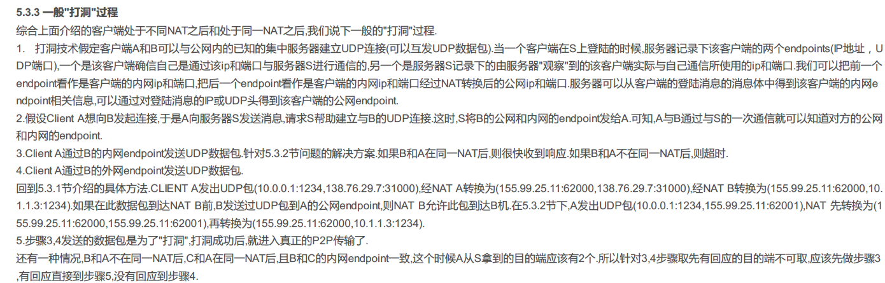

# NAT相关

## NAT三种类型
* 静态NAT 静态地址转换
  静态地址转换将内部私网地址与合法公网地址进行一对一的转换，且每个内部地址的转换都是确定的。
  **只进行了IP转换，并没进行端口转换**
* 动态NAT 动态地址转换
  动态地址转换也是将内部本地地址与内部合法地址一对一的转换，但是动态地址转换是从合法地址池中
  动态选择一个未使用的地址来对内部私有地址进行转换。 
* NAPT 地址端口转换
  它也是一种动态转换，而且多个内部地址被转换成同一个合法公网地址，使用不同的端口号来区分不同的主机，不同的进程。 
  
## 打洞原理
首先明确打洞解决的问题：两个公网环境下的私网服务器需要进行网络数据交互。（直接通信）

存在三个角色，信号发送方、信号接收方、打洞服务器

##### 打洞关键需要解决的两个问题
1. 打洞服务器通知用户双方，告知对方IP映射表（出口IP 端口）
2. 需要告知路由器双方发出的请求是合法请求，不能被抛弃

##### 关键过程
1. 用户B向打洞服务器请求，向用户A打洞
2. 服务器响应请求，并且告知A用户 B想要与你打洞，数据包含了B的地址信息
3. A主动发一条消息给B，目的在路由器A中保留一条关于路由B的IP路由信息，这条消息会被丢弃，因为路由B路由中
    没有路由A的路由信息
4. B再发一条消息给A，这个时候因为双方路由器都有对方路由器的路由信息了，所以可以直接请求了

### ICE协议下的NAT穿透实现（STUN&TURN）
分为三个角色：**STUN客户端、STUN打洞服务器、NAT路由器**

STUN服务器主要做两个事情
* 获取客户端的ip和端口并且存入ICE Candidate中
* 获取客户端NAT类型

TURN服务器主要做两个事情
* 为NAT打洞 
告知通信双方相互通信，明天双发给对方发送一条消息，这样在各自的NAT就留下了一个对方的洞，下次就可以
直接进行通信了。
* 为对称NAT提供消息转发
如果有存在一方为NAT，那么则需要TURN服务器提供消息转发服务。

